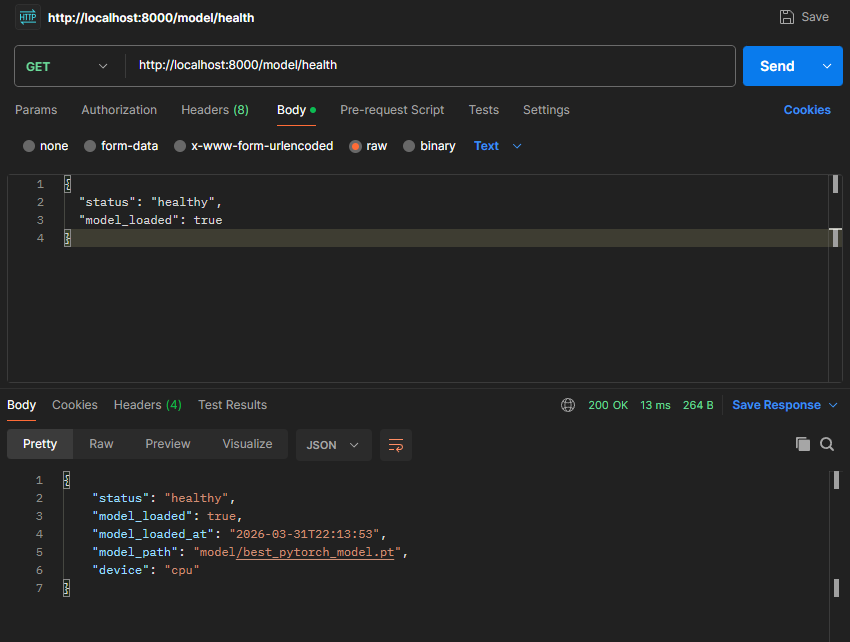
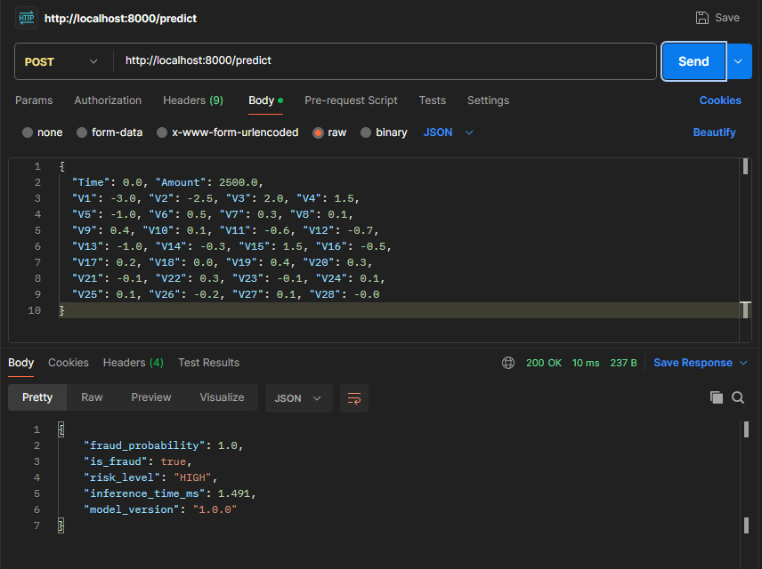
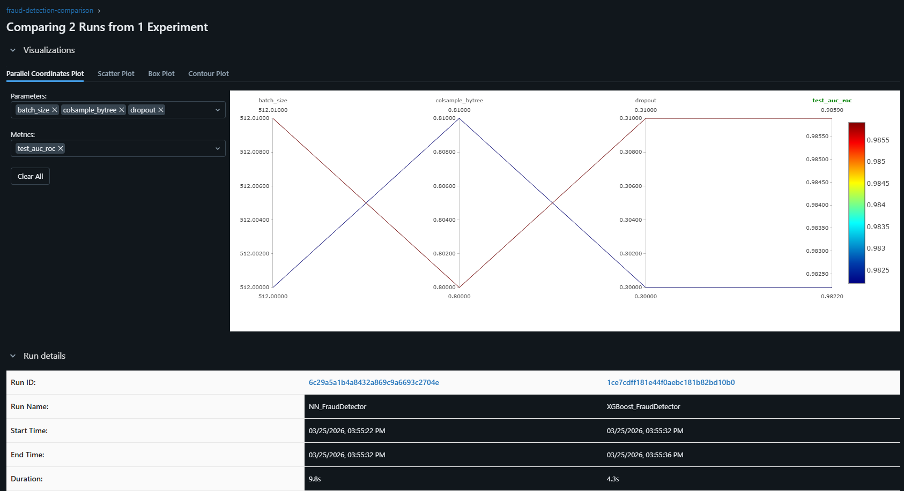

# Fraud Detection MLOps System

Real-time credit card fraud detection pipeline built with **PyTorch**, **XGBoost**, **Apache Kafka**, **MLflow**, and **FastAPI** , deployed with Docker


---

## Results

| Model     | AUC-ROC | Precision | Recall | F1    |
|-----------|---------|-----------|--------|-------|
| PyTorch NN| 0.9745  | 0.6569    | 0.9054 | 0.7614|
| XGBoost   | 0.9859  | 0.9403    | 0.8514 | 0.8936|


- Results on Kaggle Credit Card Fraud dataset
- Optimising for Recall to minimise missed fraud cases
- Pytorch deployed as primary model
- XGBoost used as a confirmation Layer

---

## Architecture

```
                    REAL-TIME INFERENCE PIPELINE            
                                                  
  Transactions → Kafka Topic → Consumer → FastAPI 
                                    ↓             
                                  Model Inference
                                               
                        
─────────────────────────────────────────────────────────────────────────

                    TRAINING PIPELINE                    
                                                         
  Raw Data → Preprocessing → Model Training  → MLflow Experiment Tracking                           
                                                        ↓
                                                      Model Registry

```

---

## Tech Stack

| Layer | Technology |
|-------|-----------|
| ML Framework | PyTorch 2.0, XGBoost |
| Model Serving | FastAPI + Uvicorn |
| Streaming | Apache Kafka |
| Experiment Tracking | MLflow |
| Containerization | Docker + Docker Compose |
| Data Processing | Scikit-learn, Pandas, NumPy |

---

## Dataset :

https://www.kaggle.com/datasets/mlg-ulb/creditcardfraud
- Get creditcard.csv
- Place it at: data/creditcard.csv

---

## Quick Start

### Option 1 — Docker run (recommended)

```bash
git clone https://github.com/Strifee/fraud-detection-mlops

cd fraud-detection-mlops

# Start all services (Kafka, MLflow, API)
docker-compose up -d

# Check API health
curl http://localhost:8000/health
```

### Option 2 — Local development

```bash
pip install -r requirements.txt

python data/preprocess.py

python model/train.py --model both

mlflow ui --port 5000
# Open http://localhost:5000

uvicorn api.main:app --reload --port 8000
# Open http://localhost:8000/docs


python streaming/kafka_simulator.py --mode simulate
```

---

## 📡 API Endpoints

### Model Health Check


### Single transaction prediction



### Interactive API docs
```
http://localhost:8000/docs
```

---

## 🧠 Model Details

### PyTorch Neural Network
- Architecture: `Input(30) → 512 → 256 → 128 → 64 → 1`
- BatchNorm + Dropout (0.3) at each layer
- BCEWithLogitsLoss with positive class weighting for imbalance
- Adam optimizer with ReduceLROnPlateau scheduler

### XGBoost
- 300 estimators, max depth 6
- scale_pos_weight=10 for class imbalance handling
- Trained with early stopping on validation AUC

### Class Imbalance Strategy
- Dataset: 0.17% fraud rate (highly imbalanced)
- PyTorch: weighted loss function
- XGBoost: scale_pos_weight parameter
- Preprocessing: controlled undersampling for training balance

---

## 📈 MLflow Experiment Tracking

All runs are tracked including:
- Hyperparameters
- Training metrics per epoch (loss, AUC, F1, Precision, Recall)
- Test set final metrics
- Inference latency
- Model artifacts

```bash
mlflow ui
# Open http://localhost:5000 to compare runs
```

